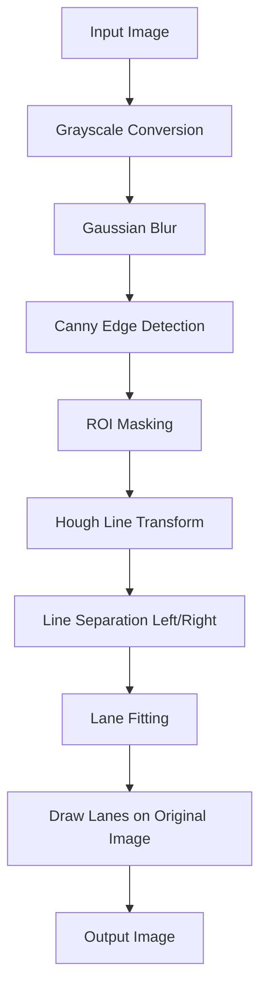

```mermaid
graph TD
    A[Input Image] --> B[Grayscale Conversion]
    B --> C[Gaussian Blur]
    C --> D[Canny Edge Detection]
    D --> E[ROI Masking]
    E --> F[Hough Line Transform]
    F --> G[Line Separation Left/Right]
    G --> H[Lane Fitting]
    H --> I[Draw Lanes on Original Image]
    I --> J[Output Image]
```
