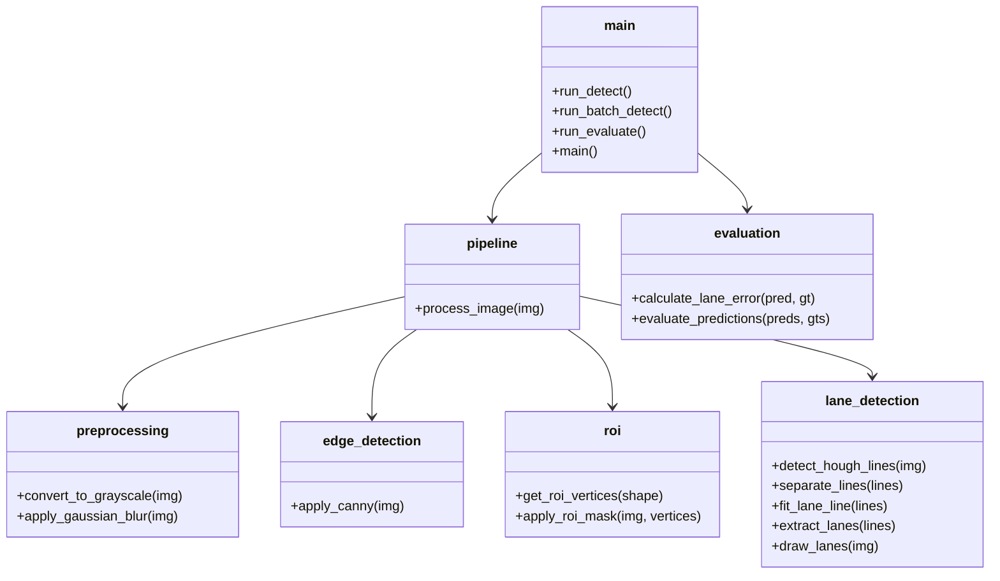

```mermaid
classDiagram
    class main {
        +run_detect()
        +run_batch_detect()
        +run_evaluate()
        +main()
    }
    class pipeline {
        +process_image(img)
    }
    class preprocessing {
        +convert_to_grayscale(img)
        +apply_gaussian_blur(img)
    }
    class edge_detection {
        +apply_canny(img)
    }
    class roi {
        +get_roi_vertices(shape)
        +apply_roi_mask(img, vertices)
    }
    class lane_detection {
        +detect_hough_lines(img)
        +separate_lines(lines)
        +fit_lane_line(lines)
        +extract_lanes(lines)
        +draw_lanes(img)
    }
    class evaluation {
        +calculate_lane_error(pred, gt)
        +evaluate_predictions(preds, gts)
    }
    
    main --> pipeline
    main --> evaluation
    pipeline --> preprocessing
    pipeline --> edge_detection
    pipeline --> roi
    pipeline --> lane_detection
```
