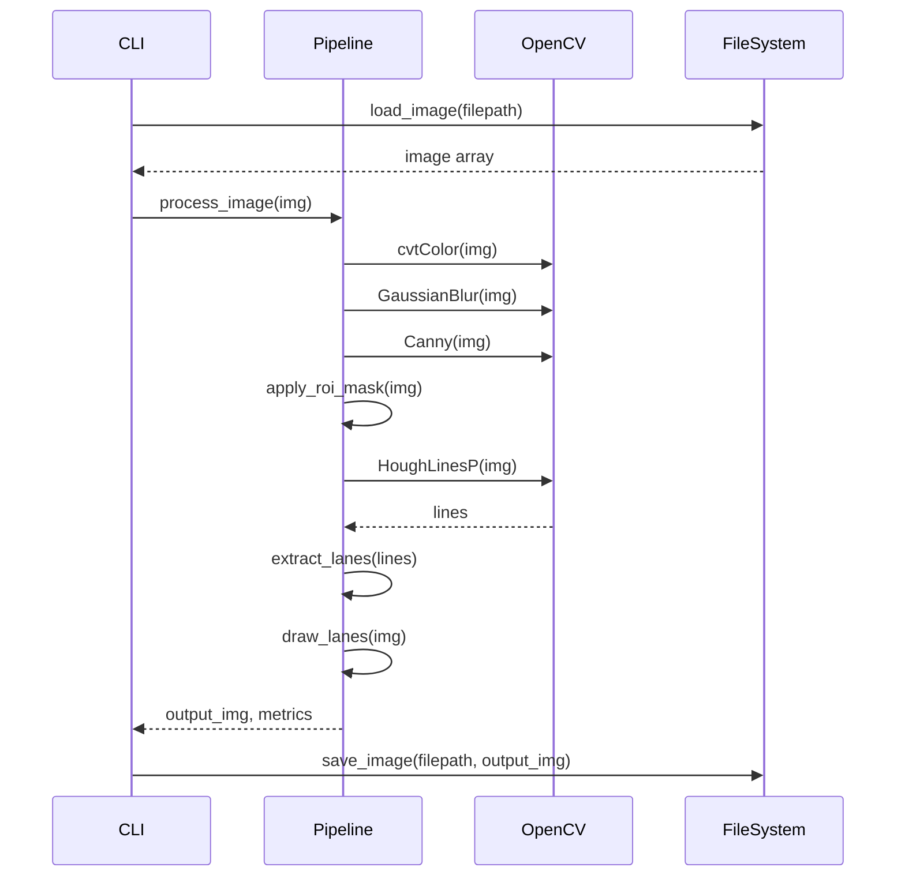

```mermaid
sequenceDiagram
    participant CLI
    participant Pipeline
    participant OpenCV
    participant FileSystem
    
    CLI->>FileSystem: load_image(filepath)
    FileSystem-->>CLI: image array
    CLI->>Pipeline: process_image(img)
    Pipeline->>OpenCV: cvtColor(img)
    Pipeline->>OpenCV: GaussianBlur(img)
    Pipeline->>OpenCV: Canny(img)
    Pipeline->>Pipeline: apply_roi_mask(img)
    Pipeline->>OpenCV: HoughLinesP(img)
    OpenCV-->>Pipeline: lines
    Pipeline->>Pipeline: extract_lanes(lines)
    Pipeline->>Pipeline: draw_lanes(img)
    Pipeline-->>CLI: output_img, metrics
    CLI->>FileSystem: save_image(filepath, output_img)
```
