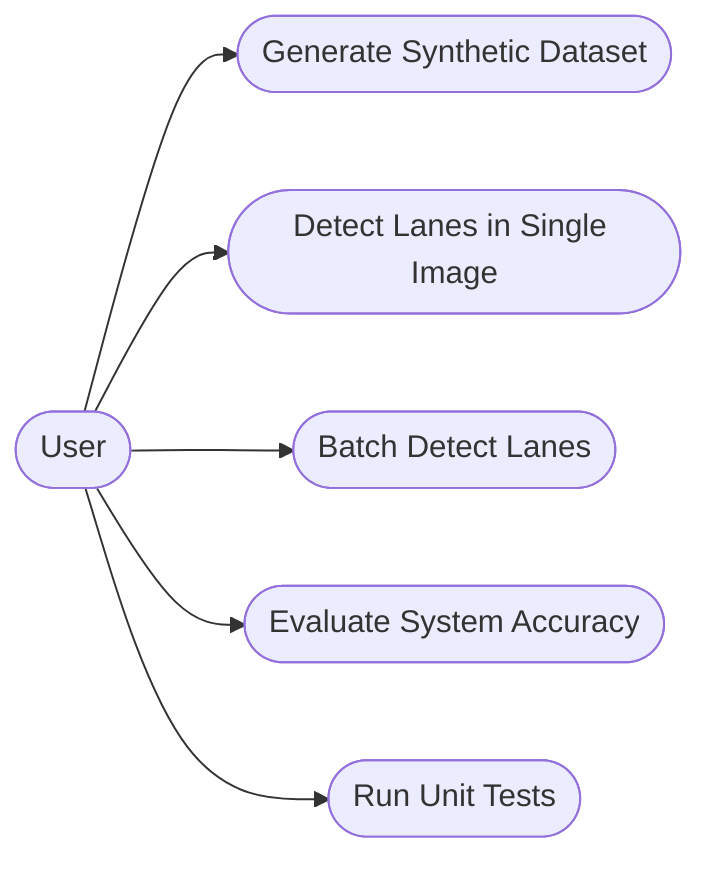

```mermaid
flowchart LR
    User([User])
    User --> Gen([Generate Synthetic Dataset])
    User --> Det([Detect Lanes in Single Image])
    User --> Batch([Batch Detect Lanes])
    User --> Eval([Evaluate System Accuracy])
    User --> Test([Run Unit Tests])
```
