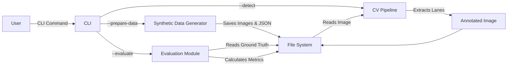

```mermaid
flowchart LR
    User -->|CLI Command| CLI
    CLI -->|--prepare-data| Generator[Synthetic Data Generator]
    Generator -->|Saves Images & JSON| Disk[File System]
    CLI -->|--detect| Pipeline[CV Pipeline]
    Disk -->|Reads Image| Pipeline
    Pipeline -->|Extracts Lanes| Output[Annotated Image]
    Output --> Disk
    CLI -->|--evaluate| Eval[Evaluation Module]
    Eval -->|Reads Ground Truth| Disk
    Eval -->|Calculates Metrics| Disk
```
